## Evaluation of Vienna WebGPU Engine

This folder contains the datasets and outputs used in the thesis evaluation. The index below lists the relevant datasets and links to the section where related outputs and figures are shown.

| What | Where | Subsection |
| --- | --- | --- |
| Survey long data | [data/long_dataset.csv](data/long_dataset.csv) | [Survey datasets](#survey-datasets) |
| Paired pre/post data | [data/paired_dataset.csv](data/paired_dataset.csv) | [Survey datasets](#survey-datasets) |
| Topic pre/post long data | [data/topic_pre_post_long.csv](data/topic_pre_post_long.csv) | [Survey datasets](#survey-datasets) |
| Question metadata | [data/question_metadata.csv](data/question_metadata.csv) | [Question and participant metadata](#question-and-participant-metadata) |
| Study level counts | [data/study_level_counts.csv](data/study_level_counts.csv) | [Question and participant metadata](#question-and-participant-metadata) |
| Study group counts | [data/study_group_counts_masterphd_vs_others.csv](data/study_group_counts_masterphd_vs_others.csv) | [Question and participant metadata](#question-and-participant-metadata) |
| Participant gain ranking | [data/participant_gain_ranking.csv](data/participant_gain_ranking.csv) | [Question and participant metadata](#question-and-participant-metadata) |
| Derived metrics | [data/derived_metrics.csv](data/derived_metrics.csv) | [Derived metrics and reliability](#derived-metrics-and-reliability) |
| Reliability blocks | [data/reliability_blocks.csv](data/reliability_blocks.csv) | [Derived metrics and reliability](#derived-metrics-and-reliability) |
| Topic boxplot stats | [data/topic_boxplot_stats.csv](data/topic_boxplot_stats.csv) | [Derived metrics and reliability](#derived-metrics-and-reliability) |
| Hypothesis test results | [data/hypothesis_results.csv](data/hypothesis_results.csv) | [Hypothesis and study-level analysis](#hypothesis-and-study-level-analysis) |
| H1 LOC vs API | [data/h1_loc_api_comparison.csv](data/h1_loc_api_comparison.csv) | [Hypothesis and study-level analysis](#hypothesis-and-study-level-analysis) |
| H1 WebGPU API calls | [data/h1_api_calls_webgpu.txt](data/h1_api_calls_webgpu.txt) | [Hypothesis and study-level analysis](#hypothesis-and-study-level-analysis) |
| H1 Vulkan API calls | [data/h1_api_calls_vulkan.txt](data/h1_api_calls_vulkan.txt) | [Hypothesis and study-level analysis](#hypothesis-and-study-level-analysis) |
| H2 study summary | [data/h2_study_level_summary.csv](data/h2_study_level_summary.csv) | [Hypothesis and study-level analysis](#hypothesis-and-study-level-analysis) |
| H2 study tests | [data/h2_study_level_test.csv](data/h2_study_level_test.csv) | [Hypothesis and study-level analysis](#hypothesis-and-study-level-analysis) |
| H3 study summary | [data/h3_study_level_summary.csv](data/h3_study_level_summary.csv) | [Hypothesis and study-level analysis](#hypothesis-and-study-level-analysis) |
| H3 study tests | [data/h3_study_level_test.csv](data/h3_study_level_test.csv) | [Hypothesis and study-level analysis](#hypothesis-and-study-level-analysis) |
| H3 Likert distribution | [data/h3_likert_distribution_q26_q33.csv](data/h3_likert_distribution_q26_q33.csv) | [Hypothesis and study-level analysis](#hypothesis-and-study-level-analysis) |
| H3 Likert stacked wide | [data/h3_likert_stacked_wide.csv](data/h3_likert_stacked_wide.csv) | [Hypothesis and study-level analysis](#hypothesis-and-study-level-analysis) |

### Survey datasets
- [data/long_dataset.csv](data/long_dataset.csv) - Raw long-form survey data (participant, question, pre/post, topic, tutorial completion).
- [data/paired_dataset.csv](data/paired_dataset.csv) - Paired pre/post rows for statistical testing.
- [data/topic_pre_post_long.csv](data/topic_pre_post_long.csv) - Topic-level pre/post comparison dataset.

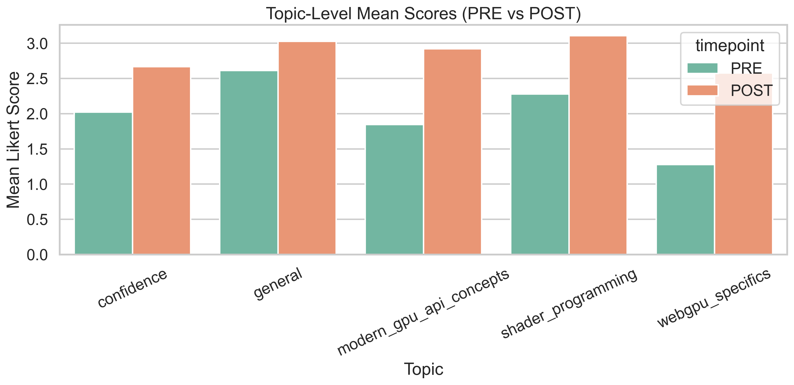

### Question and participant metadata
- [data/question_metadata.csv](data/question_metadata.csv) - Question IDs, topic mapping, and grouping metadata.
- [data/study_level_counts.csv](data/study_level_counts.csv) - Participant counts by study level.
- [data/study_group_counts_masterphd_vs_others.csv](data/study_group_counts_masterphd_vs_others.csv) - Aggregated study-group counts.
- [data/participant_gain_ranking.csv](data/participant_gain_ranking.csv) - Per-participant change ranking.

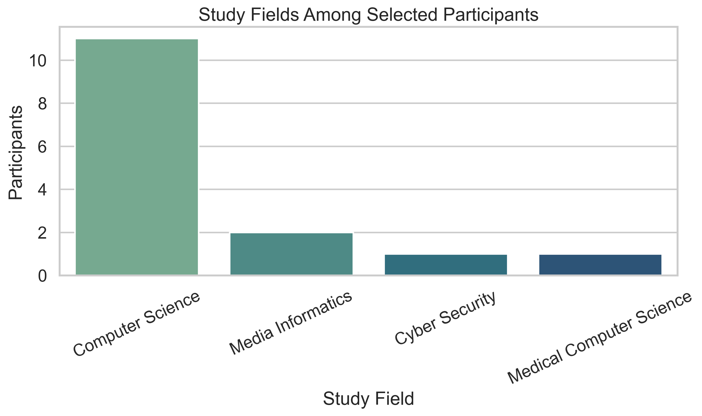
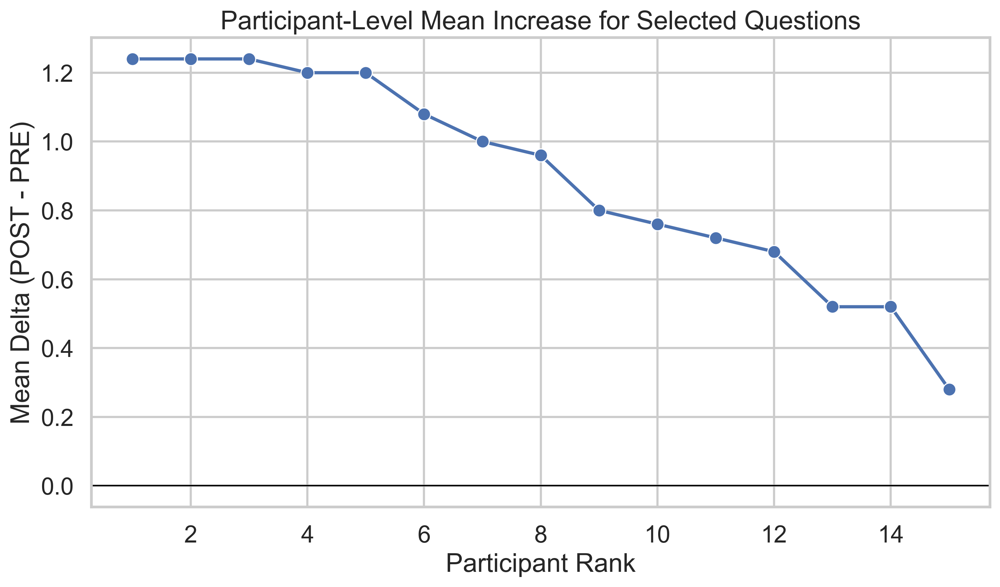

### Derived metrics and reliability
- [data/derived_metrics.csv](data/derived_metrics.csv) - Computed summary metrics (topic averages, completion counts, rating thresholds).
- [data/reliability_blocks.csv](data/reliability_blocks.csv) - Reliability analysis blocks (Cronbach alpha).
- [data/topic_boxplot_stats.csv](data/topic_boxplot_stats.csv) - Topic-level summary stats for boxplots.

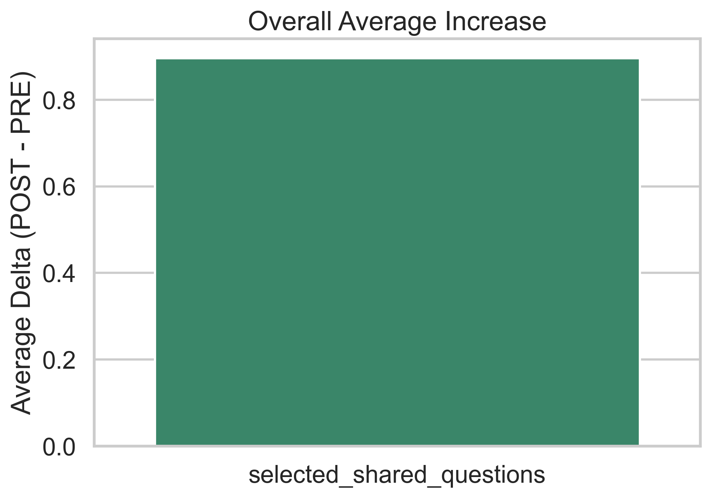
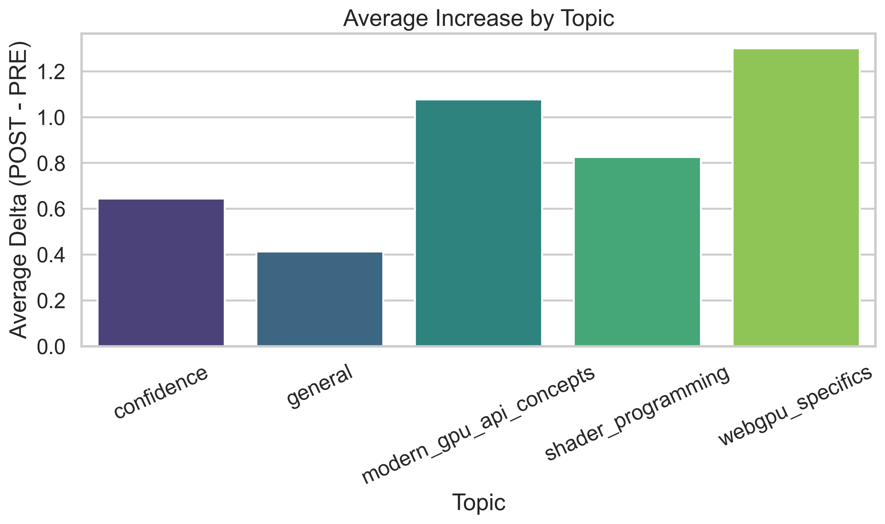
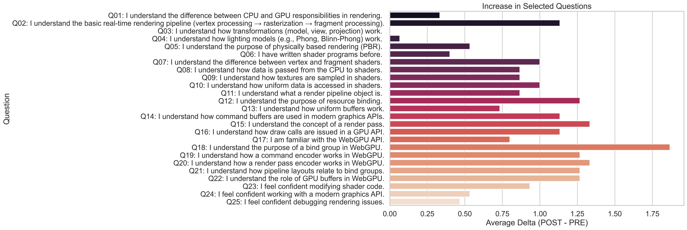
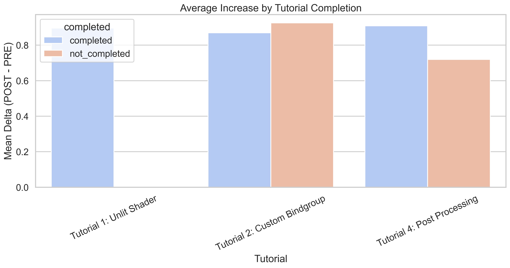
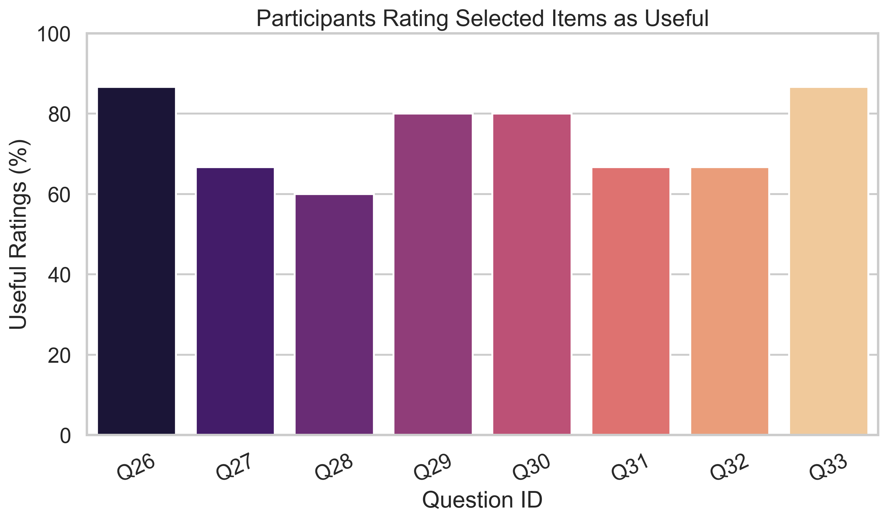

### Hypothesis and study-level analysis
- [data/hypothesis_results.csv](data/hypothesis_results.csv) - Hypothesis test results with effect sizes and corrected p-values.
- [data/h1_loc_api_comparison.csv](data/h1_loc_api_comparison.csv) - LOC vs API comparison used in H1.
- [data/h1_api_calls_webgpu.txt](data/h1_api_calls_webgpu.txt) - WebGPU API call counts used in H1.
- [data/h1_api_calls_vulkan.txt](data/h1_api_calls_vulkan.txt) - Vulkan API call counts used in H1.
- [data/h2_study_level_summary.csv](data/h2_study_level_summary.csv) - H2 study-level summary.
- [data/h2_study_level_test.csv](data/h2_study_level_test.csv) - H2 statistical tests.
- [data/h3_study_level_summary.csv](data/h3_study_level_summary.csv) - H3 study-level summary.
- [data/h3_study_level_test.csv](data/h3_study_level_test.csv) - H3 statistical tests.
- [data/h3_likert_distribution_q26_q33.csv](data/h3_likert_distribution_q26_q33.csv) - Likert distributions for Q26-Q33.
- [data/h3_likert_stacked_wide.csv](data/h3_likert_stacked_wide.csv) - Likert data in wide format for stacked charts.

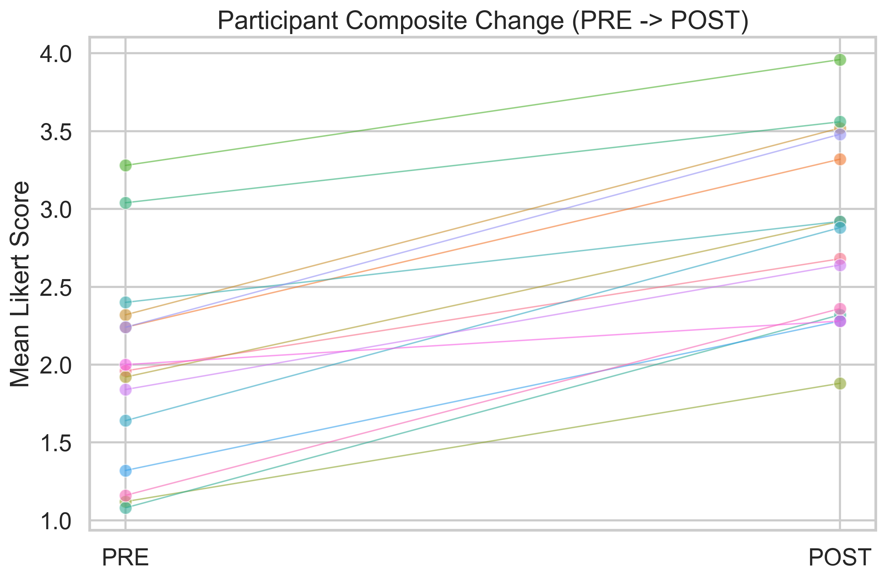
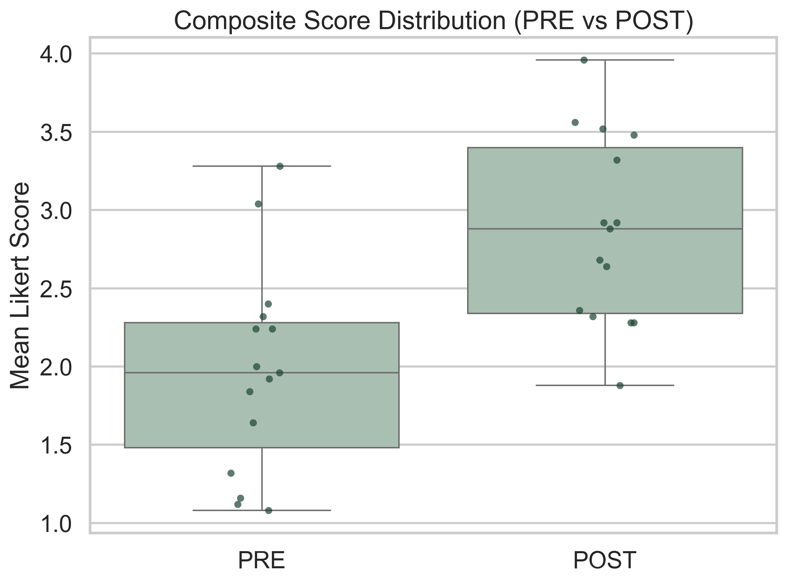
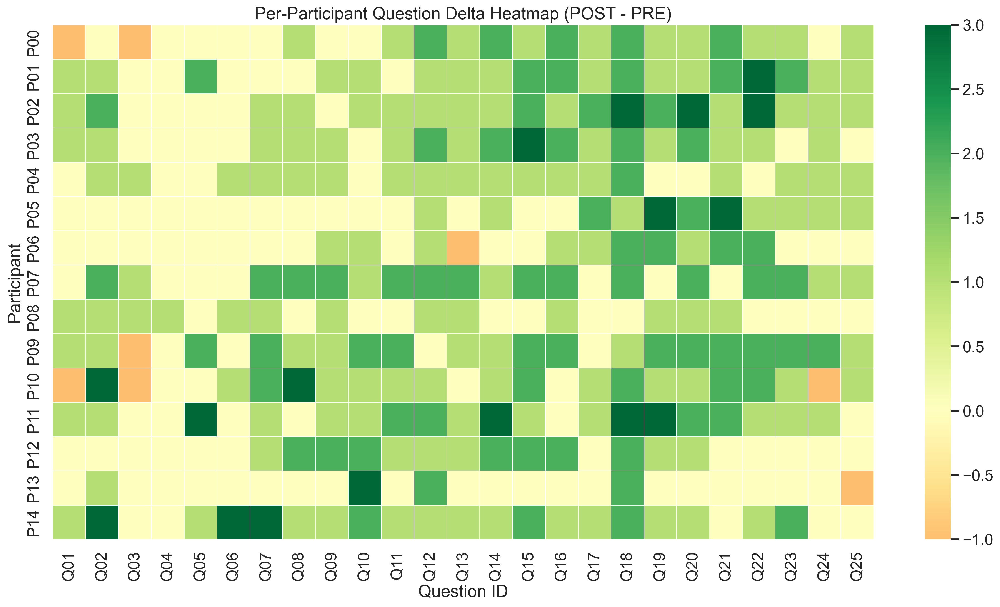