# Tutorial 04: Writing a Post-Processing Pass

> **💡 Tip:** It's recommended using the [04_postprocessing.html](04_postprocessing.html) version of this tutorial as copying code works best there regarding padding and formatting.

> **⚠️ Build issues?** See [Troubleshooting Build Failures](#troubleshooting-build-failures) at the end of this tutorial for help reading build errors from the terminal.

Welcome to the post-processing tutorial! In this guide, you'll learn how to create a render pass that applies screen-space effects to rendered images. You'll implement the **vignette post-processing effect** — a simple but effective screen-edge darkening technique — and integrate it into the engine's rendering pipeline.

**What you'll learn:**
- Engine render pass architecture and lifecycle
- Multi-pass rendering (scene → post-process → composite)
- Shader registry and pipeline manager patterns
- Bind group caching for efficient resource reuse
- Fullscreen triangle rendering technique
- Integrating new passes into the renderer pipeline

**Important Note:**
This tutorial implements **one hardcoded post-processing effect (vignette)** added to the engine. This is NOT a general-purpose configurable post-processing system. To add more effects (bloom, tone mapping, color grading), you would need to create additional shader and pass classes. A future tutorial could cover building a flexible post-processing framework.

**What you'll build:**
- Implement `PostProcessingPass` methods one by one
- Integrate into `Renderer::renderToTexture()` to apply vignette after debug rendering
- Add proper initialization and cleanup in `Renderer`

**What's provided:**
- `PostProcessingPass.h` - Complete header with all method signatures (already implemented)
- `PostProcessingPass.cpp` - Skeleton ready for your implementation
- `postprocess_vignette.wgsl` - Vignette shader (in `resources/`)
- Shader registration - Already set up in `ShaderRegistry.cpp`
- Renderer integration points - Already marked with tutorial comments

---

## Understanding the Architecture

Steps 1-4 (Shadow, Mesh, Debug, PostProcessing) are **per-camera operations**. If multiple cameras are specified, each one will have:

- Its own shadow maps
- Its own scene render
- Its own debug overlays
- Its own post-processing
  
**Frame Rendering Pipeline:**

```mermaid
graph LR
    Start([Frame Start]) --> Loop{For each camera}
    
    Loop --> Shadow["[1] Shadow Pass"]
    Shadow --> Mesh["[2] Mesh Pass"]
    Mesh --> Debug["[3] Debug Pass"]
    Debug --> Post["[4] Post-Processing ⭐<br/>← THIS TUTORIAL"]
    
    Post --> LoopEnd{More<br/>cameras?}
    LoopEnd -->|Yes| Loop
    LoopEnd -->|No| Composite
    
    Composite["[5] Composite Pass"]
    Composite --> UI["[6] UI Pass"]
    UI --> Present([Present])
    
    style Post fill:#ff9,stroke:#f66,stroke-width:2px
    style Start fill:#9f9
    style Present fill:#9f9
```


Then **Composite Pass** (step 5) combines all camera results together and renders to the final surface.

**Why Post-Process After Debug Pass?**

If we placed it before debug pass, wireframes and gizmos would not receive the vignette effect. By placing it after debug pass, all rendered content (scene + debug overlays) gets processed together.

---

## Pattern Overview

All render passes in this engine follow the same lifecycle:
```cpp
// Step 1: Create pass
auto pass = std::make_unique<PostProcessingPass>(context);

// Step 2: Initialize (one-time setup)
pass->initialize();  // Get shader, create sampler

// Step 3: Per-frame render
pass->setInputTexture(inputTex);           // Configure input
pass->setRenderPassContext(context);       // Configure output
pass->render(frameCache);                  // Execute on GPU

// Step 4: Cleanup (on shutdown/resize)
pass->cleanup();
```

---

## Step 1: PostProcessingPass::initialize()

This method performs one-time setup: loading the shader and creating the sampler.

**What to understand:**

1. **Sampler Reuse** - We get a pre-made sampler (`getClampLinearSampler()`) instead of creating one. This is more efficient and reuses GPU resources.
   
2. **Shader Registry Pattern** - Instead of loading shaders directly, we use `shaderRegistry().getShader()`. This allows:
   - Centralized shader management
   - Hot-reloading support (shaders can be updated without recompiling)
   - Bind group layout information already parsed from shader

3. **Lazy Pipeline Creation** - The pipeline is created in `getOrCreatePipeline()`, not `initialize()`. This allows:
   - Different output formats for different render targets
   - Pipeline recreation if shader reloads
   - Pattern used by `MeshPass` and `CompositePass`

**Your Task:**

Open `src/engine/rendering/PostProcessingPass.cpp` and implement the `initialize()` method:
```cpp
bool PostProcessingPass::initialize()
{
	spdlog::info("Initializing PostProcessingPass");
	// Tutorial 04 - Step 1: Get vignette shader from registry
	// The shader contains:
	// - Vertex shader (vs_main): Generates fullscreen triangle
	// - Fragment shader (fs_main): Applies vignette darkening
	// - Bind Group 0: Sampler + input texture
	auto& registry = m_context->shaderRegistry();
	m_shaderInfo = registry.getShader(shader::defaults::VIGNETTE);
	if (!m_shaderInfo || !m_shaderInfo->isValid())
	{
		spdlog::error("Vignette shader not found in registry");
		return false;
	}

	// Get a sampler for texture filtering (linear interpolation, clamp-to-edge)
	// This is a pre-made sampler shared across the engine
	m_sampler = m_context->samplerFactory().getClampLinearSampler();

	spdlog::info("PostProcessingPass initialized successfully");
	return true;
}
```

**Key Points:**

- `shader::defaults::VIGNETTE` is a constant defined in `ShaderRegistry.h` with value `"Vignette_Shader"`
- `m_shaderInfo` contains the shader module AND the bind group layout (parsed from `@group(0)` in WGSL)
- `m_sampler` is used in `getOrCreateBindGroup()` later
- The actual pipeline is created in `getOrCreatePipeline()` method (lazy initialization)

---

<div style="page-break-after: always;"></div>

## Step 2: PostProcessingPass::setInputTexture()

This method stores which texture to read post-processing input from.

**Your Task:**

In `PostProcessingPass.cpp`, find the comment: `// Tutorial 04 - Step 2` and add this code:
```cpp
void PostProcessingPass::setInputTexture(const std::shared_ptr<webgpu::WebGPUTexture> &texture)
{
	// Tutorial 04 - Step 2: Store the texture to post-process
	// This is the output of MeshPass/DebugPass (the rendered scene)
	m_inputTexture = texture;
}
```

**Why This Matters:**

- Each render target (camera) has its own texture
- Before rendering, we need to tell the pass which texture to sample from
- The texture contains the scene after mesh and debug passes

---

## Step 3: PostProcessingPass::setRenderPassContext()

This method stores where post-processing output should be written.

**Your Task:** 

In `PostProcessingPass.cpp`, find the comment: `// Tutorial 04 - Step 3` and add this code:
```cpp
void PostProcessingPass::setRenderPassContext(const std::shared_ptr<webgpu::WebGPURenderPassContext> &renderPassContext)
{
	// Tutorial 04 - Step 3: Store where to render output
	m_renderPassContext = renderPassContext;
}
```

The render pass context is created in `Renderer::renderToTexture()` with a descriptor specifying:
- **Output texture** – The texture view where this pass writes its final color result.
- **Whether to clear** – Determines if the target is cleared at the beginning of the pass.
- **Load/store operations** – Defines how the GPU handles the attachment before and after rendering.

---

<div style="page-break-after: always;"></div>

## Step 4: PostProcessingPass::getOrCreatePipeline()

This helper method handles pipeline creation with proper caching.

A **pipeline** is like a recipe that tells the GPU how to process data. It bundles together:
- **Shaders** (vertex and fragment programs)
- **Render state** (blending, culling, depth testing)
- **Vertex layout** (how vertex data is structured)
- **Output format** (what texture format we're rendering to)

Think of it as compiling your shader code into a GPU-executable program with all the settings baked in.

**Your Task:** In `PostProcessingPass.cpp`, find the comment: `// Tutorial 04 - Step 4`
```cpp
std::shared_ptr<webgpu::WebGPUPipeline> PostProcessingPass::getOrCreatePipeline()
{
	// Tutorial 04 - Step 4: Get or create pipeline
	// Try to get existing pipeline (weak_ptr pattern for cache-friendly design)
	auto pipeline = m_pipeline.lock();
	if (pipeline && pipeline->isValid())
	{
		return pipeline;  // Reuse existing pipeline
	}
	// Create new pipeline
	// This compiles the shader and packages all render state together
	m_pipeline = m_context->pipelineManager().getOrCreatePipeline(
		m_shaderInfo,  // Shader loaded in initialize()
		m_renderPassContext->getColorTexture(0)->getFormat(), // Output format
		wgpu::TextureFormat::Undefined, // No depth needed for fullscreen effect
		Topology::Triangles,  // Drawing triangles
		wgpu::CullMode::None, // Don't cull backfaces (fullscreen triangle)
		1 // Single sample (no MSAA)
	);

	pipeline = m_pipeline.lock();
	if (!pipeline || !pipeline->isValid())
	{
		spdlog::error("PostProcessingPass: Failed to create pipeline");
		return nullptr;
	}
	return pipeline;
}
```

**Why weak_ptr?**

- Pipeline might be recreated (shader reload, format change)
- `weak_ptr` lets us check if it's still valid without preventing cleanup
- Pattern used throughout the engine for cache management

---

## Step 5: PostProcessingPass::recordAndSubmitCommands() - WebGPU Command Lifecycle

This method handles the entire WebGPU command recording and submission lifecycle for drawing the fullscreen effect.

WebGPU uses a **command buffer pattern** - instead of immediately executing GPU operations, as this is more efficient than immediate-mode APIs and allows better parallelization:
1. **Record** commands into a buffer (CPU work)
2. **Submit** the buffer to GPU queue (GPU work)
3. GPU executes commands asynchronously

**Your Task:** In `PostProcessingPass.cpp`, find the comment: `// Tutorial 04 - Step 5` and add this code:

```cpp
void PostProcessingPass::recordAndSubmitCommands(
	const std::shared_ptr<webgpu::WebGPUPipeline> &pipeline,
	const std::shared_ptr<webgpu::WebGPUBindGroup> &bindGroup
)
{
	// Tutorial 04 - Step 5: Record and submit all GPU commands
	// CommandEncoder records GPU commands into a command buffer
	auto encoder = m_context->createCommandEncoder("PostProcessing");

	// This creates a RenderPassEncoder for recording drawing commands
	wgpu::RenderPassEncoder renderPass = encoder.beginRenderPass(
		m_renderPassContext->getRenderPassDescriptor()
	);
	// This tells the GPU which vertex/fragment shaders to run
	renderPass.setPipeline(pipeline->getPipeline());
	// Step 5B: Bind resources (textures, samplers) to shader
	// This connects our input texture to @group(0) in the shader
	renderPass.setBindGroup(0, bindGroup->getBindGroup(), 0, nullptr);
	// Step 5C: Draw 3 vertices to create fullscreen triangle
	// The vertex shader generates positions procedurally from vertex_index
	renderPass.draw(3, 1, 0, 0);

	// End render pass and submit to GPU
	renderPass.end();
	renderPass.release();

	// Finish encoding
	wgpu::CommandBufferDescriptor commandBufferDesc{};
	commandBufferDesc.label = "PostProcessing Commands";
	wgpu::CommandBuffer commandBuffer = encoder.finish(commandBufferDesc);
	encoder.release();
	// Submit to GPU queue
	m_context->getQueue().submit(commandBuffer);
	commandBuffer.release();
}
```

**What Each Command Does:**

- **setPipeline** → "Use this shader program and render settings"
- **setBindGroup** → "Here are the textures/samplers the shader needs"
- **draw** → "Process these vertices through the pipeline"

The GPU will:
1. Run vertex shader 3 times (once per vertex)
2. Rasterize the triangle to cover the screen
3. Run fragment shader for every pixel
4. Write results to output texture

**Command Recording Flow:**
```
CommandEncoder (CPU-side command buffer)
    └─> RenderPassEncoder (records drawing commands)
            ├─> setPipeline()    (Step 5A)
            ├─> setBindGroup()   (Step 5B)
            └─> draw()           (Step 5C)
    └─> finish() → CommandBuffer (ready for GPU)
        └─> queue.submit() → GPU executes
```

---

<div style="page-break-after: always;"></div>

## Step 6: PostProcessingPass::render() - Main Orchestration

The main render method coordinates everything: validation, resource setup, and command submission.

**Your Task:**

In `PostProcessingPass.cpp`, find the comment: `// Tutorial 04 - Step 6` and add this code:

```cpp
void PostProcessingPass::render(FrameCache &frameCache)
{
	// Tutorial 04 - Step 6: Main render orchestration

	// Step 6A: Validate we have everything we need
	if (!m_inputTexture || !m_renderPassContext)
	{
		spdlog::warn("PostProcessingPass: Missing input texture or render pass context");
		return;
	}

	// Step 6B: Get pipeline (creates if needed)
	auto pipeline = getOrCreatePipeline();
	if (!pipeline)
		return;

	// Step 6C: Get bind group for input texture (creates if needed)
	auto bindGroup = getOrCreateBindGroup(m_inputTexture);
	if (!bindGroup)
	{
		spdlog::error("PostProcessingPass: Failed to create bind group");
		return;
	}

	// Step 6D: Record and submit all GPU commands
	recordAndSubmitCommands(pipeline, bindGroup);
}
```

**What Each Step Does:**

- **6A** - Validate inputs (texture and render pass context must be set)
- **6B** - Get or create the render pipeline (lazy initialization)
- **6C** - Get or create bind group for the input texture
- **6D** - Call `recordAndSubmitCommands()` to handle WebGPU operations (Step 5)

This separation keeps `render()` focused on **what** to do (validation and setup) while `recordAndSubmitCommands()` handles **how** to do it (the WebGPU details).

---

<div style="page-break-after: always;"></div>

## Step 7: PostProcessingPass::getOrCreateBindGroup()

Simplified bind group creation using the engine's factory.

A **bind group** packages GPU resources (textures, samplers, buffers) that shaders can access. Think of it as:
- **Shader side:** `@group(0) @binding(1) var myTexture: texture_2d<f32>`
- **CPU side:** Bind group that says "binding 1 = this specific texture"

**Your Task:** In `PostProcessingPass.cpp`, find the comment: `// Tutorial 04 - Step 7` and add this code:

```cpp
std::shared_ptr<webgpu::WebGPUBindGroup> PostProcessingPass::getOrCreateBindGroup(
	const std::shared_ptr<webgpu::WebGPUTexture> &texture
)
{
	// Tutorial 04 - Step 7: Create or retrieve bind group
	if (!texture)
		return nullptr;

	// Step 7A: Check cache (avoid recreating each frame)
	auto cacheKey = reinterpret_cast<uint64_t>(texture.get());
	auto it = m_bindGroupCache.find(cacheKey);
	if (it != m_bindGroupCache.end())
		return it->second;

	// Step 7B: Get layout from shader╬
	// The shader defines what bindings Group 0 expects
	auto bindGroupLayout = m_shaderInfo->getBindGroupLayout(0);
	if (!bindGroupLayout)
		return nullptr;

	// Step 7C: Create bind group using engine factory
	// This maps our texture + sampler to the shader's bindings
	auto bindGroup = m_context->bindGroupFactory().createBindGroup(
		bindGroupLayout,
		{
			{{0, 0}, webgpu::BindGroupResource(m_sampler)}, // @binding(0) = sampler
			{{0, 1}, webgpu::BindGroupResource(texture)}	// @binding(1) = texture
		},
		nullptr,
		"PostProcess BindGroup"
	);

	if (!bindGroup || !bindGroup->isValid())
		return nullptr;

	// Step 7D: Cache for next frame
	m_bindGroupCache[cacheKey] = bindGroup;
	return bindGroup;
}
```

**Binding Layout:**
```wgsl
// In shader (postprocess_vignette.wgsl):
@group(0) @binding(0) var inputSampler: sampler;
@group(0) @binding(1) var inputTexture: texture_2d<f32>;

// In C++ (this method):
{{0, 0}, BindGroupResource(m_sampler)}     // Group 0, Binding 0 = sampler
{{0, 1}, BindGroupResource(texture)}       // Group 0, Binding 1 = texture
```

The factory handles the low-level WebGPU API calls for us.

---

## Step 8: PostProcessingPass::cleanup()

This method releases cached resources.

**Your Task:**

In `PostProcessingPass.cpp`, find the comment: `// Tutorial 04 - Step 8` and add this code:
```cpp
void PostProcessingPass::cleanup()
{
	// Tutorial 04 - Step 8: Release bind group cache
	// Called on shutdown or window resize
	// The pipeline and sampler are managed already elsewhere
	// We only need to clear bind group cache
	m_bindGroupCache.clear();
}
```

**Why Only Clear Cache?**

- `m_shaderInfo` - Managed by shader registry
- `m_sampler` - Managed by sampler factory (shared resource)
- `m_pipeline` - Managed by pipeline manager (weak_ptr, auto-cleans)
- `m_inputTexture` - Managed by caller (Renderer)
- `m_renderPassContext` - Managed by caller (Renderer)
- `m_bindGroupCache` - **We** own this, so we must clean it

---

<div style="page-break-after: always;"></div>

## Step 9: Renderer::initialize() - Add PostProcessingPass Setup

Now integrate the pass into the renderer.

**Your Task:**

Open `src/engine/rendering/Renderer.cpp` and find the `initialize()` method. Look for the comment: `// Tutorial 04 - Step 9` and add this code:
```cpp
	// Tutorial 04 - Step 9: Initialize PostProcessingPass
	m_postProcessingPass = std::make_unique<PostProcessingPass>(m_context);
	if (!m_postProcessingPass->initialize())
	{
		spdlog::error("Failed to initialize PostProcessingPass");
		return false;
	}
```

**What's Happening:**

During initialization, we create the PostProcessingPass object and call its `initialize()` method. This one-time setup:
- Loads the vignette shader from the shader registry
- Gets a pre-made sampler for texture filtering
- Prepares the pass for rendering (actual rendering happens in the render phase, not initialization)

---

## Step 10: Prepare Post-Processing Texture

Before we can render to a post-process texture, we need to create it.

**Your Task:**

Open `src/engine/rendering/Renderer.cpp` and find the comment: `// Tutorial 04 - Step 10`

After the depth buffer setup (and before the Culling step), add this code to create the post-processing texture:
```cpp
	if (!m_postProcessTextures[renderTargetId])
	{
		m_postProcessTextures[renderTargetId] = 
				m_context->textureFactory().createRenderTarget(
				-renderTargetId - 1,
				renderFromTexture->getWidth(),
				renderFromTexture->getHeight(),
				renderFromTexture->getFormat() // match format of main render target
			);
	}
```

**What This Does:**

- Creates an intermediate texture with the same dimensions and format as the main render target
- Uses negative ID (`-renderTargetId - 1`) to distinguish post-process textures from main render targets
- Only creates the texture once; reuses it for subsequent frames

---

## Step 11: Renderer::renderToTexture() - Call PostProcessingPass

This is where post-processing actually executes each frame.

**Your Task:**

In `Renderer.cpp`, find the comment: `// Tutorial 04 - Step 11`

Add this code after the Debug Pass section:
```cpp
	// Tutorial 04 - Step 11: Apply vignette effect
	// Texture swapping: MeshPass/DebugPass output → input for post-processing
	// Output: Post-processed image (stored in m_postProcessTextures for Composite)
	renderFromTexture = renderToTexture; // Reads from the main render target
	renderToTexture = m_postProcessTextures[renderTargetId];
	auto postProcessingContext = m_context->renderPassFactory().create(
		renderToTexture,  // Color attachment (post-process output)
		nullptr,		  // No depth attachment (use existing depth)
		ClearFlags::None, // Don't clear anything
		renderTarget.backgroundColor
	);

	m_postProcessingPass->setCameraId(renderTargetId);
	m_postProcessingPass->setInputTexture(renderFromTexture);
	m_postProcessingPass->setRenderPassContext(postProcessingContext);
	m_postProcessingPass->render(m_frameCache);
```

**How It Works:**

1. **Texture Swapping:**
   - `renderFromTexture = renderToTexture` - Save the current render target (scene + debug)
   - `renderToTexture = m_postProcessTextures[renderTargetId]` - Switch output to an intermediate post-process texture

2. **Rendering:**
   - Create a render pass that outputs to the post-process texture
   - `setInputTexture(renderFromTexture)` - Tell post-processing to READ from the scene texture
   - `setRenderPassContext(postProcessingContext)` - Tell post-processing to WRITE to the intermediate texture
   - `render()` - Execute the vignette shader

3. **Result:**
   - Input: Scene + debug overlays (from MeshPass + DebugPass)
   - Processing: Vignette shader darkens the edges
   - Output: Post-processed image in `m_postProcessTextures[renderTargetId]`
   - Next step: CompositePass will use this post-processed texture

**Why Separate Textures?**

Using intermediate textures allows:
- Read and write to different textures (required by WebGPU)
- Chain multiple post-processing effects
- Keep original scene data for debugging
- Proper texture synchronization between passes

---

## Step 12: Renderer::onResize() - Handle Post-Processing Texture Resize

When the window is resized, all textures need to be updated to match the new dimensions.

**Location:** In `Renderer::onResize()` the resizing of post-processing-textures should be added. \
Find the comment: `// Tutorial 04 - Step 12` and add this code:


```cpp
auto postProcessingTexture = m_postProcessTextures[id];
if (postProcessingTexture)
	postProcessingTexture->resize(*m_context, viewPortWidth, viewPortHeight);
```

Some lines below there is another comment `// Tutorial 04 - Step 12`. Here the `cleanup()` method from Step 8 will be called.
```cpp
// Clear bind group cache and reset
if (m_postProcessingPass)
	m_postProcessingPass->cleanup();
```

**What This Does:**

- Resizes the post-processing texture to match the new window dimensions
- Calls `cleanup()` on PostProcessingPass to clear the bind group cache
  - The cached bind groups are tied to the old texture dimensions
  - Next frame, new bind groups will be created with the correct dimensions

---

## Rebuild and Run
```bash
# Rebuild and run
scripts\build-example.bat tutorial Debug WGPU
examples/build/tutorial/Windows/Debug/Tutorial.exe
```

**VS Code shortcuts:**
- Press `F5` to build and run with debugger
- Or open **Run and Debug** panel (`Ctrl+Shift+D`) → select **"Tutorial (Debug)"** → click green play button

---

## Expected Result

You should see:
- ✅ **Vignette Effect** - Screen edges are darker, center is brighter
- ✅ **Smooth Falloff** - Gradual transition from center to edges
- ✅ **Applied to Everything** - Both 3D scene and debug overlays affected
- ✅ **Screen-Space** - Effect doesn't rotate with camera movement

### Visual Test

- **Move camera around** - Vignette stays screen-aligned (doesn't follow camera)
- **Look at bright areas** - Center remains visible despite vignette
- **Look at edges** - Edges are noticeably darker
---

## WebGPU Concepts Explained

### Command Recording Pattern

**Why not immediate execution?**
```cpp
// ❌ Immediate mode (old OpenGL style):
glUseProgram(shader);
glBindTexture(texture);
glDrawArrays();  // Executes NOW on CPU thread

// ✅ Command buffer (WebGPU):
encoder.setPipeline(pipeline);   // Record command
encoder.setBindGroup(bindGroup); // Record command  
encoder.draw(3);                 // Record command
queue.submit(buffer);            // GPU executes ALL commands async
```

**Benefits:**
- GPU can optimize command execution
- CPU doesn't wait for GPU
- Better parallelization
- Can record on multiple threads

### Resource Binding Hierarchy
```
Pipeline
  ├─ Shaders (vertex + fragment)
  ├─ Render State (blend, cull, depth)
  └─ Bind Group Layouts (describes what resources needed)
        └─ Bind Groups (actual resources)
              ├─ @binding(0) → Sampler
              ├─ @binding(1) → Texture
              └─ @binding(2) → Buffer (if needed)
```

### Why Caching Matters

**Without caching:**
```cpp
// Every frame:
createPipeline()     // Compile shaders, validate state
createBindGroup()    // Allocate GPU memory, setup bindings
draw()
// Heavy CPU and GPU overhead!
```

**With caching:**
```cpp
// First frame:
createPipeline() → cache
createBindGroup() → cache

// Subsequent frames:
pipeline = cache.get()    // Fast lookup
bindGroup = cache.get()   // Fast lookup
draw()
// Minimal overhead!
```

---

## Summary: Complete Flow

Here's what happens each frame:
```cpp
// Frame setup (Renderer::renderFrame)
  └─ For each camera:
       └─ Renderer::renderToTexture(camera)
            ├─ MeshPass::render()           // Renders 3D scene
            │   └─ Output: renderTarget.gpuTexture with lit scene
            │
            ├─ DebugPass::render()          // Renders wireframes, gizmos
            │   └─ Output: Same texture, with debug overlays added
            │
            ├─ PostProcessingPass::render() // ← YOU ADDED THIS!
            │   ├─ Step 6A: Validate inputs
            │   ├─ Step 6B: Get pipeline
            │   ├─ Step 6C: Get bind group
            │   └─ Step 6D: recordAndSubmitCommands() {
            │        - Step 5A: Set pipeline
            │        - Step 5B: Bind resources
            │        - Step 5C: Draw 3 vertices
            │        - Finish and submit to GPU
            │      }
            │   └─ Output: Same texture, but with vignette effect
            │
            └─ CompositePass::render()      // Copies to surface
                └─ Output: Final image on screen
```

---

## Understanding the Vignette Shader

The vignette effect happens in `resources/postprocess_vignette.wgsl`:

**Shader Structure:**
```wgsl
// Bind Group 0: Input texture from previous render pass
@group(0) @binding(0) var inputSampler: sampler;
@group(0) @binding(1) var inputTexture: texture_2d<f32>;

// Vertex shader output / Fragment shader input
struct VertexOutput {
    @builtin(position) position: vec4f,
    @location(0) texCoord: vec2f,
}
```

**Vertex Shader (`vs_main`):**

Generates a fullscreen triangle without vertex buffers using bit manipulation on the vertex index:
```wgsl
@vertex
fn vs_main(@builtin(vertex_index) vertexIndex: u32) -> VertexOutput {
    var output: VertexOutput;
    
    // Bit manipulation to generate triangle coordinates
    // vertexIndex: 0 -> (0, 0), 1 -> (2, 0), 2 -> (0, 2)
    let x = f32((vertexIndex << 1u) & 2u);
    let y = f32(vertexIndex & 2u);
    
    // Convert to NDC: (0,0) -> (-1,1), (2,0) -> (3,1), (0,2) -> (-1,-3)
    output.position = vec4f(x * 2.0 - 1.0, 1.0 - y * 2.0, 0.0, 1.0);
    
    // Pass through texture coordinates (0 to 1 range)
    output.texCoord = vec2f(x, y);
    
    return output;
}
```

This creates a triangle that covers the entire screen:
- Vertex 0: (-1, -1) bottom-left  → UV (0, 0)
- Vertex 1: (3, -1) bottom-right  → UV (1, 0) [off-screen]
- Vertex 2: (-1, 3) top-left      → UV (0, 1) [off-screen]

**Fragment Shader (`fs_main`):**

Applies the vignette effect by darkening edges based on distance from center:
```wgsl
@fragment
fn fs_main(input: VertexOutput) -> @location(0) vec4f {
    // Sample the rendered scene color
    let sceneColor = textureSample(inputTexture, inputSampler, input.texCoord);
    
    // Calculate distance from screen center (0.5, 0.5)
    let center = vec2f(0.5, 0.5);
    let dist = distance(input.texCoord, center);
    
    // Vignette parameters
    let vignetteIntensity = 0.85;  // How dark edges get (0.0 = no effect, 1.0 = black)
    let vignetteFalloff = 2.0;    // Transition sharpness (higher = sharper edge)
    
    // Calculate vignette factor (1.0 at center, approaches 0.0 at edges)
    // smoothstep creates a smooth S-curve interpolation
    let vignette = 1.0 - smoothstep(0.0, 1.0, dist * vignetteFalloff);
    
    // Mix between darkened (1.0 - intensity) and full brightness (1.0)
    let vignetteFactor = mix(1.0 - vignetteIntensity, 1.0, vignette);
    
    // Apply vignette by multiplying scene color
    let finalColor = sceneColor * vignetteFactor;
    
    return finalColor;
}
```

**How the Vignette Calculation Works:**

1. **Distance from Center** - Calculate how far each pixel is from screen center (0.5, 0.5)
2. **Smoothstep Transition** - Use `smoothstep()` to create a smooth falloff curve
3. **Mix Factor** - Interpolate between darkened edges and full brightness
4. **Apply Effect** - Multiply scene color by the vignette factor to darken edges

---

## Key Concepts Learned

- ✅ **Render Pass Lifecycle** - initialize() → render() → cleanup()
- ✅ **Shader Registry** - Centralized shader management with hot-reload support
- ✅ **Pipeline Manager** - Lazy pipeline creation with caching
- ✅ **Bind Group Caching** - Efficient resource reuse across frames
- ✅ **Fullscreen Triangle** - Procedural vertex generation in shader
- ✅ **Multi-Pass Rendering** - Reading from previous pass output
- ✅ **Screen-Space Effects** - Operations in normalized screen coordinates
- ✅ **Command Recording** - WebGPU's deferred command submission pattern

---

## What's Next?

You've implemented a **hardcoded post-processing effect** that's baked into the engine. To extend this:

1. **Add more effects** - Create new shader + new PostProcessingPass-like class for each effect
2. **Multiple passes** - Chain effects (vignette → bloom → tone mapping)
3. **Effect selection** - Allow runtime effect switching via configuration
4. **Framework design** - Build a flexible system supporting arbitrary effects

Future tutorials could cover these advanced topics!

---

## Reference

- Shader source: `resources/postprocess_vignette.wgsl`
- Pass header: `include/engine/rendering/PostProcessingPass.h`
- Pass implementation: `src/engine/rendering/PostProcessingPass.cpp`
- Renderer integration: `src/engine/rendering/Renderer.cpp`
- Shader registration: `src/engine/rendering/ShaderRegistry.cpp`
- Similar passes: `CompositePass.cpp`, `MeshPass.cpp`, `ShadowPass.cpp`

---

## Further Reading

- [WebGPU WGSL Specification](https://www.w3.org/TR/WGSL/)
- [Engine Bind Group System](../BindGroupSystem.md)
- [Getting Started Guide](../GettingStarted.md)
- [LearnWebGPU Tutorial](https://eliemichel.github.io/LearnWebGPU/)

---

## Troubleshooting Build Failures

**⚠️ Important:** When using `scripts/build.bat`, the task system may report success even if the build actually failed. You **MUST check the terminal output** to see the real result.

**What to look for in terminal:**
1. Scroll to the **very end** of the terminal output
2. Look for `[SUCCESS] Build completed successfully!` - if this appears, build succeeded
3. If you see `[ERROR] Build failed.` - the build failed regardless of task status

**Common issues in post-processing:**
- **Shader errors in vignette shader** - Check `.wgsl` for missing semicolons
- **Bind group layout mismatch** - Verify shader layout matches C++ registration
- **Missing pipeline creation** - Ensure `getOrCreatePipeline()` is called before rendering
- **CMake cache issues** - Delete `build/` folder and rebuild clean

**Debug Strategy:**
1. Open `PostProcessingPass.cpp` in your editor
2. Add a breakpoint in the `render()` method
3. Press `F5` to start debugging with VS Code
4. Check the **Terminal Output** panel - errors will show exact line numbers